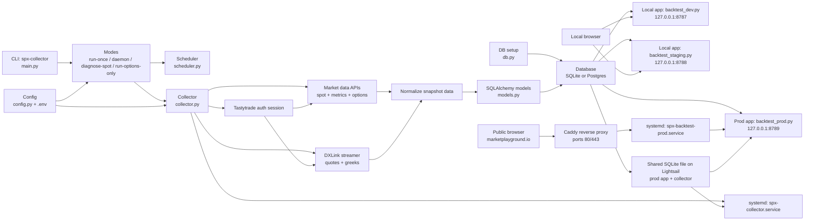

# Architecture

This repo has three connected layers:

- a collector that fetches SPX spot/options data from Tastytrade
- SQLite or Postgres storage for normalized market snapshots
- Python HTTP apps that expose local and public strategy tooling

## High-Level Flow

## Runtime Paths

### 1. Collector path

- `src/spx_collector/main.py` is the CLI entrypoint.
- `src/spx_collector/scheduler.py` controls timed collection runs.
- `src/spx_collector/collector.py` authenticates, fetches market data, streams greeks, normalizes records, and writes snapshots.
- `src/spx_collector/models.py` and `src/spx_collector/db.py` define and initialize storage.

### 2. Local UI path

- `src/spx_collector/backtest_dev.py` is the local dev playground.
- `src/spx_collector/backtest_staging.py` is the local staging playground.
- Both apps serve HTML plus `/api/options/*` and `/api/query` routes from Python.
- The browser talks to Python handlers first, then those handlers query the database.

### 3. Public website path

- `src/spx_collector/backtest_prod.py` is the public website app.
- On Lightsail it runs behind `deploy/systemd/spx-backtest-prod.service`.
- `deploy/caddy/marketplayground.io.Caddyfile` reverse proxies the public domain to `127.0.0.1:8789`.
- The public request path is:

`Browser -> Caddy -> backtest_prod.py -> SQLite`

Operator setup details live in [lightsail_prod_setup.md](/Users/nikhilmalkani/Desktop/Projects/historical%20spx%20data/docs/lightsail_prod_setup.md).

## Current Design Tradeoffs

- The three backtest apps duplicate a large amount of Python and inline frontend code.
- Frontend HTML, CSS, and JS live inside Python `_HTML` strings, which keeps deployment simple but makes UI maintenance harder.
- The public prod app and collector currently share the same SQLite file on the Lightsail instance. That keeps the stack simple, but it also means prod read latency can be affected by database shape, payload size, and collector/server contention.

## Deployment Workflow

- Treat the local repo as the source of truth.
- Use Lightsail as a deploy target, not the primary edit surface.
- Normal workflow is: test locally in dev/staging, promote approved changes into `backtest_prod.py`, merge to `main`, then fast-forward the server repo and restart services.

## Likely Cleanup Path

If this grows further, the highest-value cleanup path is:

1. share more server logic across `backtest_dev.py`, `backtest_staging.py`, and `backtest_prod.py`
2. move frontend assets out of Python strings
3. keep env-specific files as thin wrappers over shared handlers and UI modules
