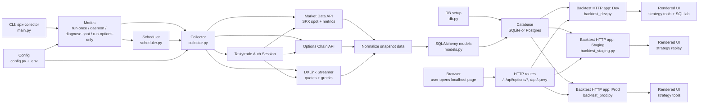

# Architecture

This repo has two main parts:

- a collector that pulls SPX data from Tastytrade and stores it
- local backtest UI apps that read from the database over HTTP

## High-Level Flow

## What Each Part Does

### 1. CLI and scheduling

- `src/spx_collector/main.py` is the command entrypoint.
- It supports modes like `run-once`, `daemon`, `diagnose-spot`, and `run-options-only`.
- `src/spx_collector/scheduler.py` controls timed collection runs.

### 2. Data collection

- `src/spx_collector/collector.py` is the core collector.
- It authenticates with Tastytrade.
- It requests market data and market metrics.
- It selects option contracts and streams quotes/greeks.
- It converts that raw data into snapshot rows ready for storage.

### 3. Storage layer

- `src/spx_collector/models.py` defines the SQLAlchemy tables.
- `src/spx_collector/db.py` sets up the database connection/session.
- Data is stored in SQLite by default, but the code also supports Postgres through `DB_URL`.

### 4. Backtest UI layer

- `src/spx_collector/backtest_dev.py`
- `src/spx_collector/backtest_staging.py`
- `src/spx_collector/backtest_prod.py`

These files run local HTTP apps.

The browser does not talk to the database directly. The real path is:

`Browser -> HTTP routes -> Python handler code -> Database`

That is why the diagram shows the browser flowing through routes like:

- `/`
- `/api/options/*`
- `/api/query`

before data reaches the database.

## Current Architecture Notes

### Strong parts

- The collector flow is fairly clear: fetch, normalize, store.
- The database layer is simple.
- The backtest UIs read from a local HTTP server instead of mixing browser code with direct DB access.

### Current tradeoffs

- The three backtest files are very similar and duplicate a lot of logic.
- The frontend is embedded as large `_HTML` strings inside Python files.
- That makes quick iteration easy, but it also makes bigger UI changes harder to maintain.

## If This Grows Later

The most likely cleanup path would be:

1. share more code between the three backtest apps
2. separate frontend files from Python server files
3. keep environment-specific behavior as thin wrappers
